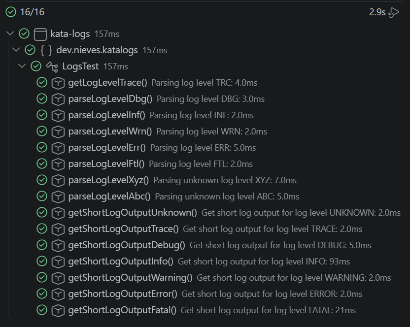

# Kata-Logs

## 🔍 Índice

- [Descripción](#-descripción)
- [Pre-requisitos](#%EF%B8%8F-pre-requisitos)
- [Estructura de carpetas](#-estructura-de-carpetas)
- [Instalación](#%EF%B8%8F-instalación)
- [Capturas](#-capturas)
- [Autora](#%EF%B8%8F-autora)

---

## 📝 Descripción

Este proyecto resuelve el kata **"Logs, Logs, Logs"**, un ejercicio de Java centrado en el uso de **enumeraciones (`enum`)** para modelar un conjunto cerrado de valores.

El objetivo es procesar líneas de log con el formato `"[<LVL>]: <MESSAGE>"` y resolver tres tareas:

1. **Analizar el nivel de log**: convertir el código abreviado de una línea de log (por ejemplo `"INF"`) en un valor tipado de la enumeración `LogLevel` (por ejemplo `LogLevel.INFO`).
2. **Soportar niveles de log desconocidos**: cuando el código no coincide con ningún nivel conocido, se devuelve el valor `LogLevel.UNKNOWN` en lugar de `null`, evitando errores de nulidad en el resto del programa.
3. **Convertir la línea de log a formato corto**: generar una representación compacta `"<ENCODED_LEVEL>:<MESSAGE>"`, donde cada nivel de log se traduce a un código numérico, pensado para reducir el espacio de almacenamiento de los logs.

---

## ⚙️ Pre-requisitos

- Java 21
- Apache Maven
- Git
---

## 📁 Estructura de carpetas

## Estructura de carpetas

```
kata-logs/
├── docs/                              # Documentación adicional y capturas
├── src/
│   ├── main/java/dev/nieves/katalogs/
│   │   ├── LogLevel.java              # Enum con los niveles de log y su codificación numérica
│   │   └── LogLine.java               # Clase que representa y analiza una línea de log
│   └── test/java/dev/nieves/katalogs/
│       └── LogsTest.java              # Suite de tests del kata
├── target/                            # Artefactos generados por Maven (no versionado)
├── .editorconfig                      # Configuración de estilo de código para el editor
├── .gitignore                         # Archivos y carpetas excluidos del control de versiones
├── pom.xml                            # Configuración del proyecto Maven y sus dependencias
└── README.md                          # Este archivo
```

---

## 🛠️ Instalación

1. Clonar el repositorio:
```bash
   git clone https://github.com/duran-ni/Kata-Logs
```

2. Entrar en la carpeta del proyecto:
```bash
   cd kata-logs
```

2. Ejecución de los tests:
```bash
   mvn test
```
---

## 📷 Capturas

Resultado de los 15 tests ejecutados desde el panel "Testing" de VS Code:




---

## ✍️ Autora

duran-ni
